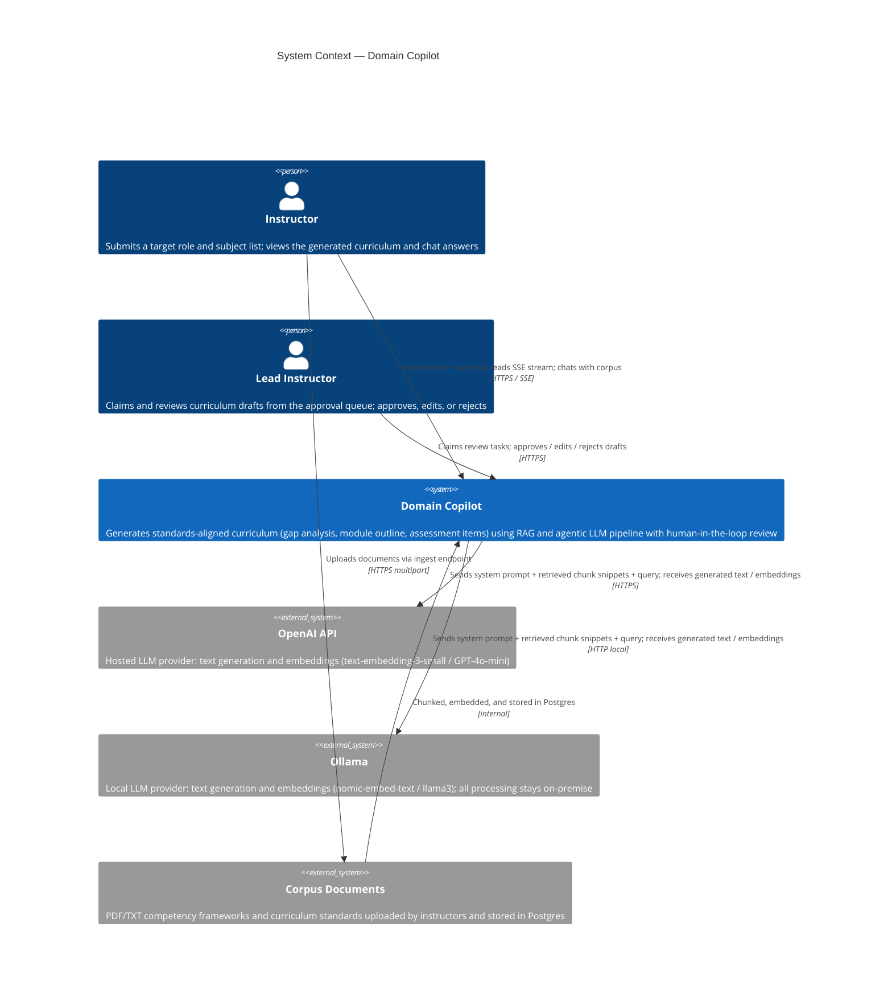
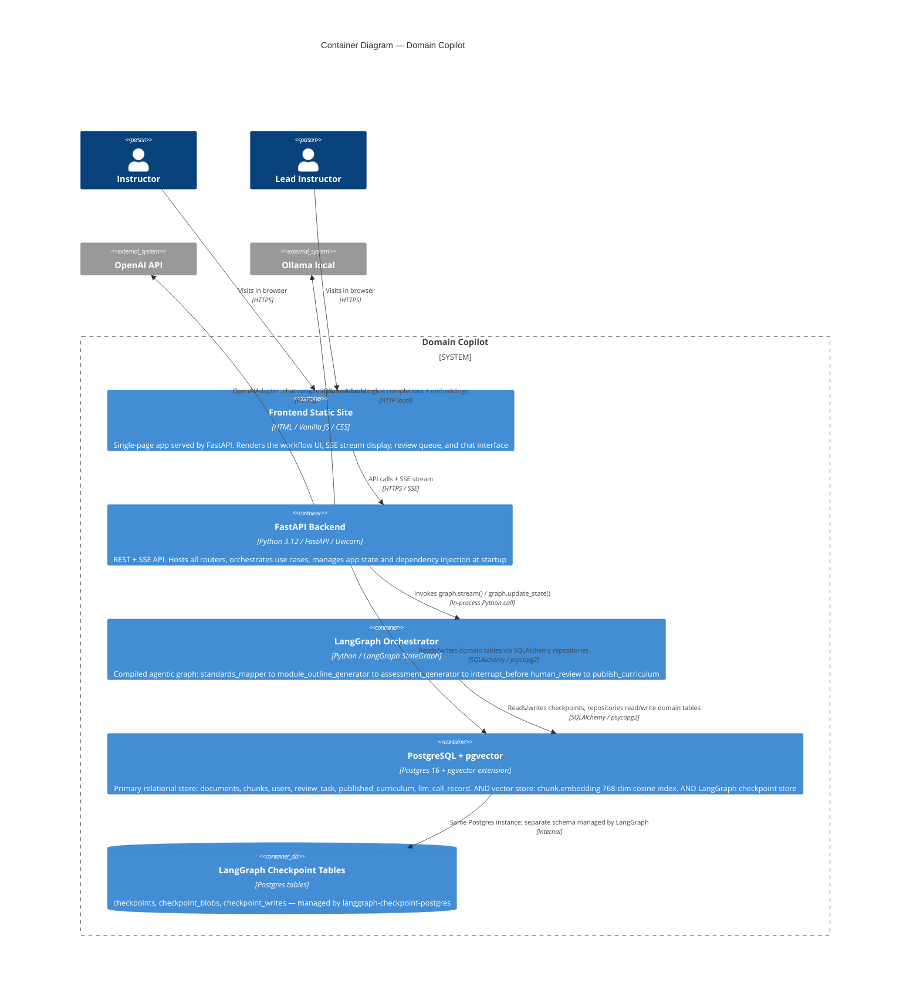
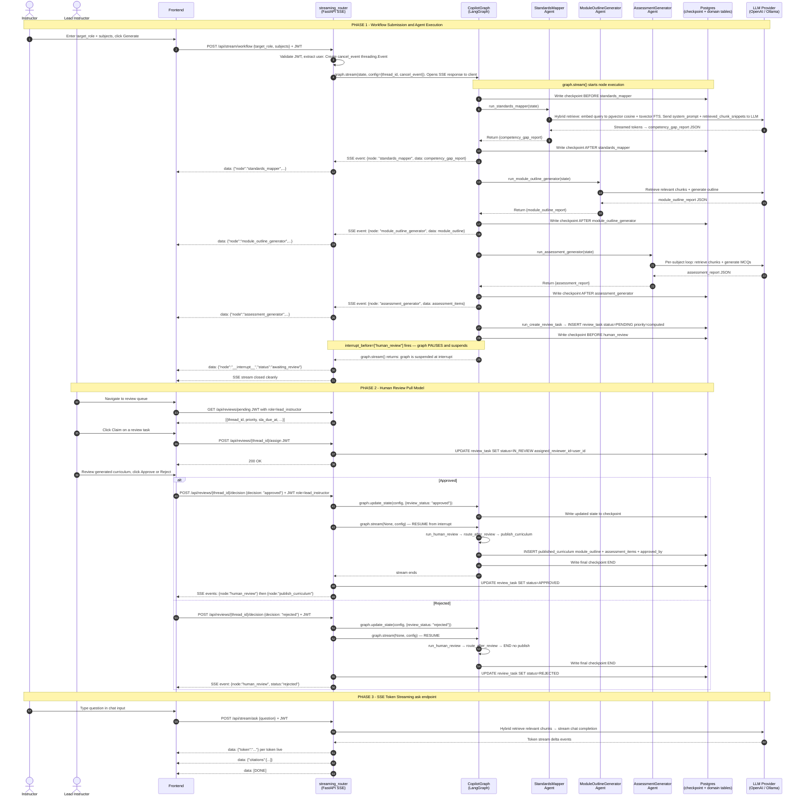
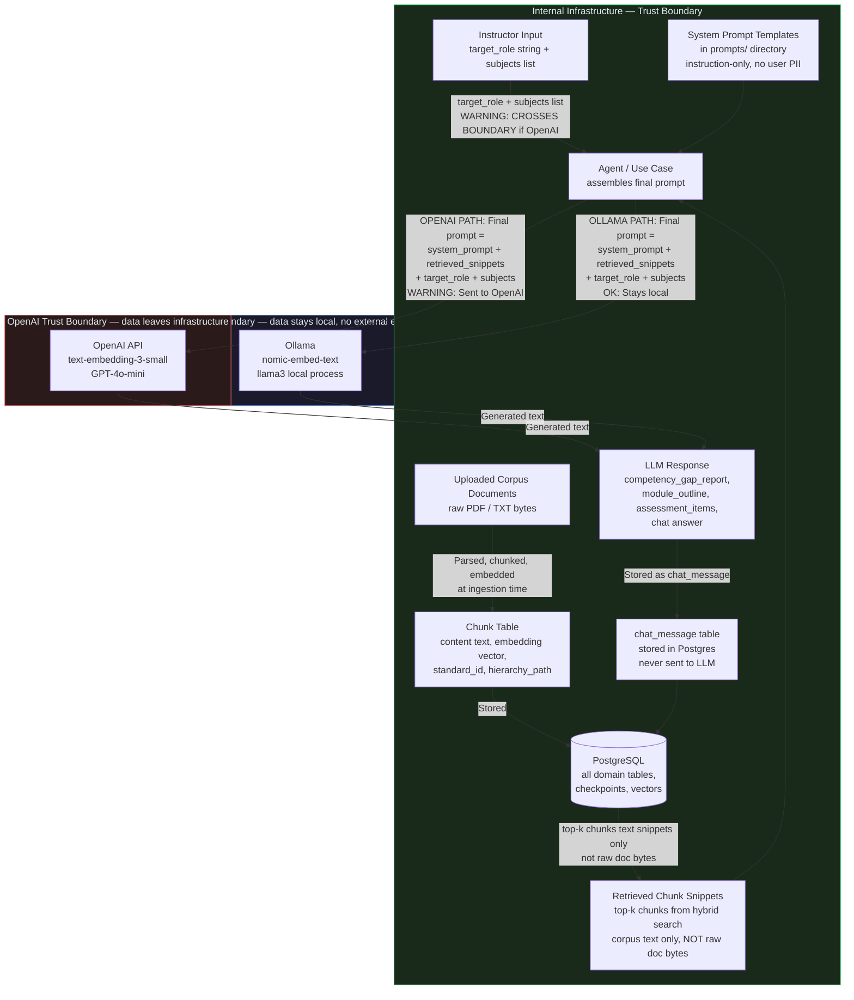
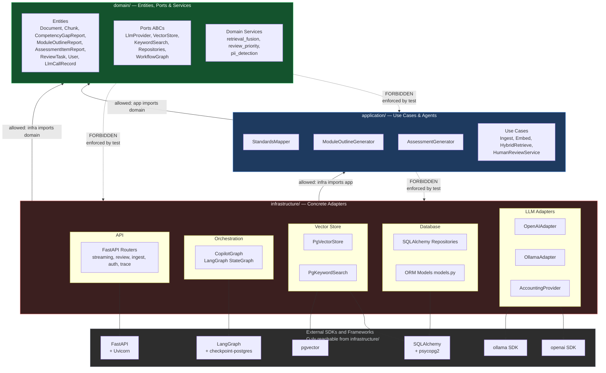

# Architecture

## API & Streaming Layer (FR-6)
- **Streaming (SSE)**: The API provides Server-Sent Events for streaming workflows (`/api/stream/workflow`) and token-by-token LLM streams (`/api/stream/ask`).
- **Cancellation**: Implements deep cancellation where a disconnected HTTP request sets a `threading.Event` which halts LangGraph execution and closes underlying LLM socket streams mid-flight.

## Workflow Orchestration
- **LangGraph**: Used as the core state machine orchestration engine to manage the AI Copilot pipeline (Standards Mapping → Outline Generation → Assessment Generation → Human Review).
- **Postgres Checkpointing**: Uses `langgraph-checkpoint-postgres` to durably save the state of the graph, allowing long-running tasks to be paused and resumed seamlessly.

## Human-in-the-Loop Review (Twist T5)
- **Pull Model**: Uses an enterprise review queue where tasks are created as "Unassigned". Lead Instructors manually claim tasks from the pending queue via `POST /api/reviews/{thread_id}/assign`.
- **Role-Based Access Control**: Strict role enforcement (`require_role("lead_instructor")`) is implemented at the FastAPI endpoint boundary for assignment and decision workflows.

## Database & Vector Storage
- **Postgres**: Serves as the primary persistence layer (managed via SQLAlchemy and Alembic) and the vector store (via `pgvector`).
- **Chat Persistence**: Full conversational history and AI citations are safely logged to a dedicated `chat_messages` table to persist sessions across page reloads.

## LLM Adapters & Cost Tracking (FR-9)
- **Adapter Pattern**: The domain logic communicates exclusively through the `LlmProvider` abstract interface. Concrete implementations include `OpenAIAdapter`, `OllamaAdapter`, and `StubLlmAdapter` (for tests).
- **AccountingProvider**: A decorator implementation of `LlmProvider` that intercepts all calls, extracts token usage/costs, and writes them to an `LlmCallRecord` in Postgres asynchronously.

---

## Diagrams

### C4 Level 1 — System Context

> The outermost view: Domain Copilot as a single system, showing all people and external systems that interact with it.



---

### C4 Level 2 — Container

> The real moving pieces: each deployable unit, how they communicate, and which external systems each one talks to.



---

### C4 Level 3 — Component (FastAPI Backend)

> Zoomed into the backend container — domain, application, and infrastructure component groups, the agents, ports, and repositories.

```mermaid
C4Component
    title Component Diagram — FastAPI Backend

    Container_Boundary(backend, "FastAPI Backend") {

        Component_Boundary(domain_layer, "domain/") {
            Component(entities, "Entities", "Pure Pydantic dataclasses", "Document, Chunk, CompetencyGapReport, ModuleOutlineReport, AssessmentItemReport, ReviewTask, User, LlmCallRecord")
            Component(ports, "Ports interfaces", "Python ABCs", "LlmProvider, VectorStore, KeywordSearch, DocumentRepository, ChunkRepository, ReviewTaskRepository, PublishedCurriculumRepository, WorkflowGraph")
            Component(domain_services, "Domain Services", "Pure Python", "retrieval_fusion RRF, review_priority SLA/priority compute, pii_detection")
        }

        Component_Boundary(application_layer, "application/") {
            Component(standards_mapper, "StandardsMapper Agent", "Python", "RAG + LLM: maps target role + subjects to competency gaps via hybrid retrieval")
            Component(outline_agent, "ModuleOutlineGenerator Agent", "Python", "Generates structured module outline from gap report via RAG + LLM")
            Component(assessment_agent, "AssessmentGenerator Agent", "Python", "Generates MCQ/scenario assessment items per gap subject via RAG + LLM")
            Component(use_cases, "Use Cases", "Python", "IngestDocument, ChunkDocument, EmbedChunks, HybridRetrieve, IngestPipeline, HumanReviewService")
        }

        Component_Boundary(infrastructure_layer, "infrastructure/") {
            Component(api_routers, "API Routers", "FastAPI routers", "streaming_router SSE, review_router, ingest_router, auth_router, trace_router")
            Component(copilot_graph, "CopilotGraph", "LangGraph StateGraph", "Compiled graph with interrupt_before human_review; FR-5 resilience wrappers: timeout, retry, iteration cap, cancellation")
            Component(openai_adapter, "OpenAIAdapter", "openai SDK", "Implements LlmProvider: GPT-4o-mini chat + text-embedding-3-small at 768 dims")
            Component(ollama_adapter, "OllamaAdapter", "ollama SDK", "Implements LlmProvider: local llama3 chat + nomic-embed-text at 768 dims")
            Component(accounting_provider, "AccountingProvider", "Decorator", "Wraps any LlmProvider; intercepts calls to log tokens + cost to llm_call_record table")
            Component(pgvector_store, "PgVectorStore", "SQLAlchemy + pgvector", "Implements VectorStore: cosine similarity search with 0.3 similarity floor")
            Component(pg_keyword_search, "PgKeywordSearch", "SQLAlchemy tsvector", "Implements KeywordSearch: Postgres full-text search via websearch_to_tsquery")
            Component(db_repositories, "SQLAlchemy Repositories", "SQLAlchemy ORM", "SqlAlchemyDocumentRepository, SqlAlchemyChunkRepository, SqlAlchemyReviewTaskRepository, SqlAlchemyPublishedCurriculumRepository")
            Component(auth, "Auth / RBAC", "FastAPI dependencies", "JWT bearer token validation, require_role() dependency, bcrypt password hashing, rate limiting via slowapi")
        }
    }

    Rel(api_routers, use_cases, "Invokes")
    Rel(api_routers, copilot_graph, "Streams / resumes via HumanReviewService")
    Rel(use_cases, ports, "Calls through port interfaces")
    Rel(standards_mapper, ports, "Calls LlmProvider + VectorStore + KeywordSearch via ports")
    Rel(outline_agent, ports, "Calls LlmProvider + VectorStore + KeywordSearch via ports")
    Rel(assessment_agent, ports, "Calls LlmProvider + VectorStore + KeywordSearch via ports")
    Rel(copilot_graph, standards_mapper, "Executes as graph node")
    Rel(copilot_graph, outline_agent, "Executes as graph node")
    Rel(copilot_graph, assessment_agent, "Executes as graph node")
    Rel(openai_adapter, ports, "Implements LlmProvider")
    Rel(ollama_adapter, ports, "Implements LlmProvider")
    Rel(accounting_provider, openai_adapter, "Wraps decorator pattern")
    Rel(pgvector_store, ports, "Implements VectorStore")
    Rel(pg_keyword_search, ports, "Implements KeywordSearch")
    Rel(db_repositories, ports, "Implements Repository ports")
    Rel(auth, api_routers, "Guards endpoints via FastAPI dependencies")
```

---

### Sequence Diagram — Full Agentic Workflow

> The complete request lifecycle: from instructor submission through the three agents, the `interrupt_before` approval-gate pause and resume, and SSE streaming back to the client. Includes the non-happy path (rejection).



---

### Data-Flow Diagram — Trust Boundaries & LLM Provider Data Exposure

> This diagram is the evidence base for the Data Exfiltration control in [SECURITY.md](./SECURITY.md#data-exfiltration-owasp-llm06).
> It shows exactly what data crosses the trust boundary to an external LLM provider versus what stays inside infrastructure.



**What the LLM provider sees (OpenAI path):**
- ✅ System prompt — instruction text only, no user data
- ⚠️ Retrieved chunk **snippets** from the corpus — corpus text, not raw uploaded bytes
- ⚠️ The instructor's `target_role` string and `subjects` list
- ✅ NOT sent: raw PDF bytes, hashed passwords, JWT tokens, other users' data, chat history, or database credentials

**No PII redaction occurs before sending.** The PII detection service (`domain/services/pii_detection.py`) logs detected PII at ingestion time only — it does not redact before LLM calls. This is a documented limitation in [SECURITY.md](./SECURITY.md#sensitive-data-disclosure).

---

### ER Diagram — Postgres Schema

> Generated directly from [`infrastructure/db/models.py`](../backend/infrastructure/db/models.py). Enum-typed columns are annotated with their valid values. LangGraph checkpoint tables are included for completeness.

```mermaid
erDiagram
    document {
        UUID     doc_id          PK "primary key"
        string   source          "filename or origin reference"
        string   version
        string   hash            UK "SHA-256 idempotency key"
        string   doc_category    "requirement or methodology or reference_curriculum or NULL"
        datetime created_at
        datetime updated_at
    }

    ingestion_status {
        UUID     id              PK
        UUID     doc_id          FK "to document.doc_id UNIQUE"
        enum     status          "pending or processing or ready or failed"
        text     error_message   "NULL unless status=failed"
        datetime updated_at
    }

    chunk {
        UUID     chunk_id        PK
        UUID     doc_id          FK "to document.doc_id"
        text     content
        int      chunk_index     "order within document; UNIQUE with doc_id"
        string   standard_id     "NULL if no standard mapping"
        string   hierarchy_path  "e.g. framework > competency > indicator"
        string   page            "page number or clause ref"
        datetime created_at
        vector   embedding       "768-dim pgvector cosine index; NULL until embedded"
        tsvector search_vector   "COMPUTED to_tsvector english content GIN-indexed"
    }

    users {
        string   user_id         PK
        string   email           UK
        string   hashed_password "bcrypt"
        string   role            "instructor or lead_instructor"
    }

    review_task {
        UUID     review_task_id      PK
        string   thread_id           UK "LangGraph thread_id"
        string   item_id
        string   target_role
        enum     status              "pending or in_review or approved or rejected or edited_approved or escalated"
        enum     priority            "high or medium or low"
        datetime sla_due_at
        string   assigned_reviewer_id "NULL until claimed by a lead_instructor"
        text     comment
        datetime created_at
        datetime updated_at
    }

    published_curriculum {
        UUID     published_id     PK
        string   thread_id        UK "LangGraph thread_id"
        string   target_role
        jsonb    module_outline
        jsonb    assessment_items
        string   approved_by
        datetime published_at
    }

    llm_call_record {
        string   call_id              PK
        string   correlation_id       "request correlation ID; indexed"
        string   thread_id            "LangGraph thread_id; NULL for chat calls; indexed"
        string   agent_name           "standards_mapper or outline_generator or assessment_generator"
        string   provider             "openai or ollama"
        string   model
        int      prompt_tokens
        int      completion_tokens
        float    estimated_cost_usd
        datetime created_at
    }

    chat_message {
        UUID     message_id      PK
        string   user_id         FK "to users.user_id; indexed"
        string   role            "user or assistant"
        text     content
        jsonb    citations       "NULL for user messages; array of citation objects"
        datetime created_at
    }

    langgraph_checkpoints {
        string   thread_id       PK "composite PK"
        string   checkpoint_ns   PK "composite PK"
        string   checkpoint_id   PK "composite PK"
        jsonb    checkpoint       "full serialised graph state"
        jsonb    metadata
    }

    document ||--|| ingestion_status : "has one"
    document ||--o{ chunk : "has many"
    users ||--o{ chat_message : "sends"
    review_task }o--o| users : "assigned_to nullable"
```



---

### Layer-Dependency Diagram

> Proves the dependency direction enforced by [`tests/test_architecture_boundaries.py`](../backend/tests/test_architecture_boundaries.py).
> Arrows show **who depends on whom**. Solid arrows = allowed imports. Dashed arrows = forbidden (mechanically tested).



---

## Architecture Decision Records

The full ADR files live in [`docs/adr/`](./adr/). The decisions are summarised here for cross-referencing with the diagrams above.

### ADR-000 — Architecture Style (Accepted)

**Decision**: Adopt Clean Architecture layering — `domain/` (entities + ports, zero external imports), `application/` (agents + use cases, depends only on `domain.ports`), `infrastructure/` (all concrete adapters). An automated boundary test (`test_architecture_boundaries.py`) mechanically enforces that `domain/` and `application/` never import restricted SDK/framework packages. See the **Layer-Dependency Diagram** above.

**Why**: LLM provider APIs and model names are expected to change. Isolating them in `infrastructure/` means swapping OpenAI → Ollama (or any future provider) touches only one adapter file, never domain logic.

---

### ADR-001 / ADR-006 — Chunking & Hybrid Retrieval (Accepted)

**Decision**: Reciprocal Rank Fusion (RRF, k=60) over two independent retrieval legs:

- **Dense leg**: `pgvector` cosine similarity on `chunk.embedding` (768-dim). Enforces a **0.3 minimum cosine similarity floor** before a chunk is a candidate — added after the first real eval run showed 0% refusal correctness without it (cosine search always returns top-k regardless of actual relevance; see `EVALUATION.md`).
- **Keyword leg**: Postgres full-text search via `tsvector` / `websearch_to_tsquery` on `chunk.search_vector` (computed column, GIN-indexed).
- **Fusion formula**: `score(chunk) = Σ 1/(60 + rank)` summed over whichever result lists the chunk appears in.

**Why not weighted linear combination**: `ts_rank` and cosine similarity are on incomparable scales; rank-based fusion avoids requiring normalisation.

**Rejected**: A mirroring ts_rank threshold for the keyword leg — Postgres FTS already only returns genuine lexical matches (unlike dense search's always-return-top-k), so a threshold adds false-negative risk without fixing the actual remaining failure case (q21-style coincidental single-word matches). Documented as an accepted limitation in `EVALUATION.md`.

---

### ADR-003 / ADR-005 — Vector Store Choice & Embedding Dimensions (Accepted)

**Decision**: `pgvector` as an extension on the same Postgres instance already used for relational data — not a separate dedicated vector database (Qdrant, Pinecone, Chroma). Embedding dimension standardised at **768** across both providers:
- `OpenAIAdapter`: calls `text-embedding-3-small` with `dimensions=768` (model supports native dimension reduction via this parameter).
- `OllamaAdapter`: uses `nomic-embed-text`, which is natively 768-dim.

This means switching `LLM_PROVIDER` in config never requires a schema migration — both adapters produce vectors that fit the same column.

**Why not a dedicated vector DB**: Running a second database service adds real operational complexity (another container, another connection string, another failure mode) for a corpus of ~500 chunks — well within what pgvector's `ivfflat` index (lists=100) handles comfortably.

**Known constraint**: If a future embedding model doesn't support reduction to 768, this decision needs revisiting. The `ivfflat` index is calibrated for low-thousands of rows; a switch to HNSW would be needed at an order-of-magnitude larger corpus.

---

### ADR-002 — Orchestration Pattern (T5's Central Decision — Accepted)

**Decision**: LangGraph `StateGraph` as the orchestration engine for the three-agent pipeline, compiled with `interrupt_before=["human_review"]` and a `PostgresSaver` checkpointer. See the **Sequence Diagram** above for the exact pause/resume mechanism.

**Why LangGraph over manual orchestration / Celery / a plain pipeline**:
- **Durable pause**: `interrupt_before` causes the graph to checkpoint its full state to Postgres and suspend — the process can restart without losing work. Manual `asyncio` or thread coordination has no native equivalent.
- **Resume semantics**: `graph.update_state()` + `graph.stream(None, config)` is the explicit, tested resume path (exercised in `test_architecture_boundaries.py` and `review_router.py`). The graph does not re-run completed nodes.
- **Audit trail**: `CopilotState.audit_trail` uses `operator.add` so every node appends to a persisted list — the full execution history is in the checkpoint.

**FR-5 resilience controls applied at the graph level** (not inside individual agents):
- `MAX_ITERATIONS = 10` iteration cap across all nodes
- Per-step timeouts (`STEP_TIMEOUT_SECONDS = 300`, `ASSESSMENT_TIMEOUT_SECONDS = 1200`) via `ThreadPoolExecutor` (Windows-compatible; no `signal.alarm`)
- `MAX_RETRIES = 2` with exponential backoff (`2^attempt` seconds) for transient LLM failures
- Deep cancellation via `cancel_event` (`threading.Event`) propagated through `RunnableConfig` into every agent, closing the underlying LLM socket stream mid-flight

---

### ADR-004 — Review Task Assignment & Priority (T5 Pull-Model — Accepted)

**Decision**: Human review uses a **pull model** with computed SLA and priority. See the **Sequence Diagram** (Phase 2) above for the full flow.

- On `create_review_task` node execution, a `review_task` row is inserted with `status=PENDING` and no assigned reviewer.
- Priority is computed by `domain/services/review_priority.py` based on the gap report (number of gaps, presence of high-severity standards). Values: `HIGH / MEDIUM / LOW`.
- SLA deadline computed from priority: HIGH → 24 h, MEDIUM → 72 h, LOW → 7 days.
- Lead Instructors see all `PENDING` tasks in the queue and claim one via `POST /api/reviews/{thread_id}/assign` (role-gated by `require_role("lead_instructor")`). This avoids the thundering-herd problem of push-assignment when multiple reviewers are online simultaneously.
- Decision endpoint (`POST /api/reviews/{thread_id}/decision`) calls `graph.update_state()` then immediately streams the resumed graph — the review is synchronous from the API caller's perspective but the graph state is durably checkpointed in Postgres before and after.
